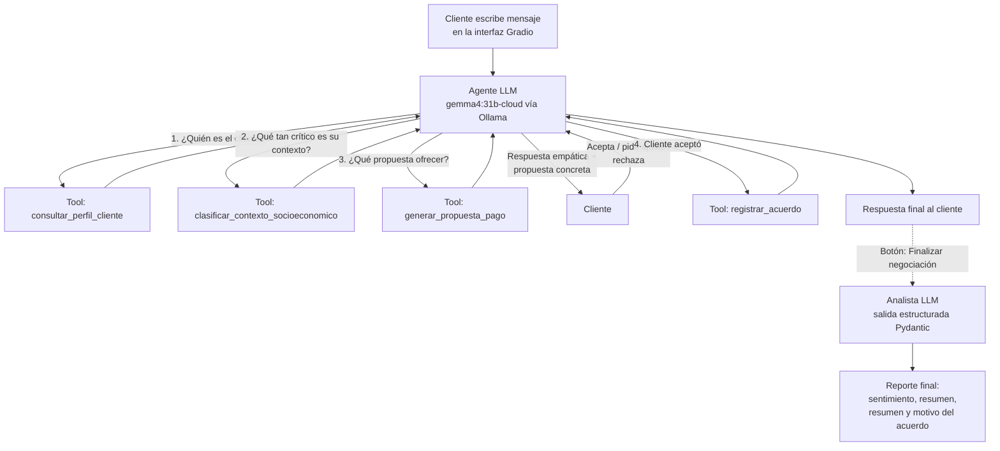
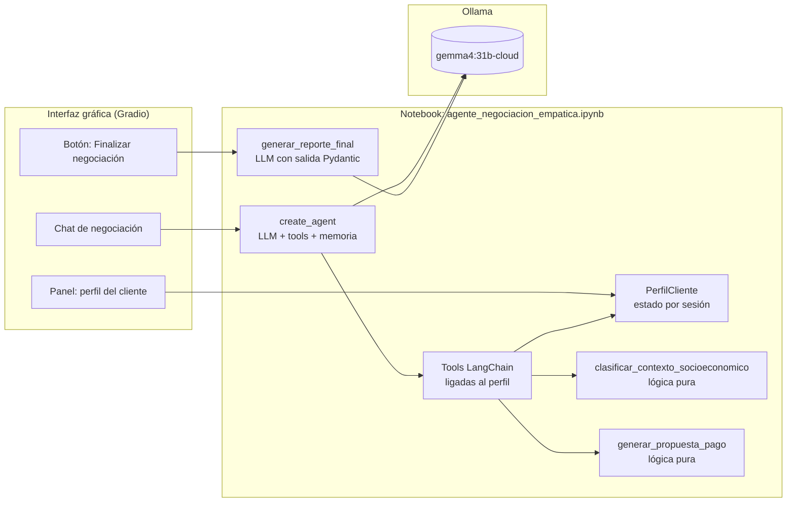
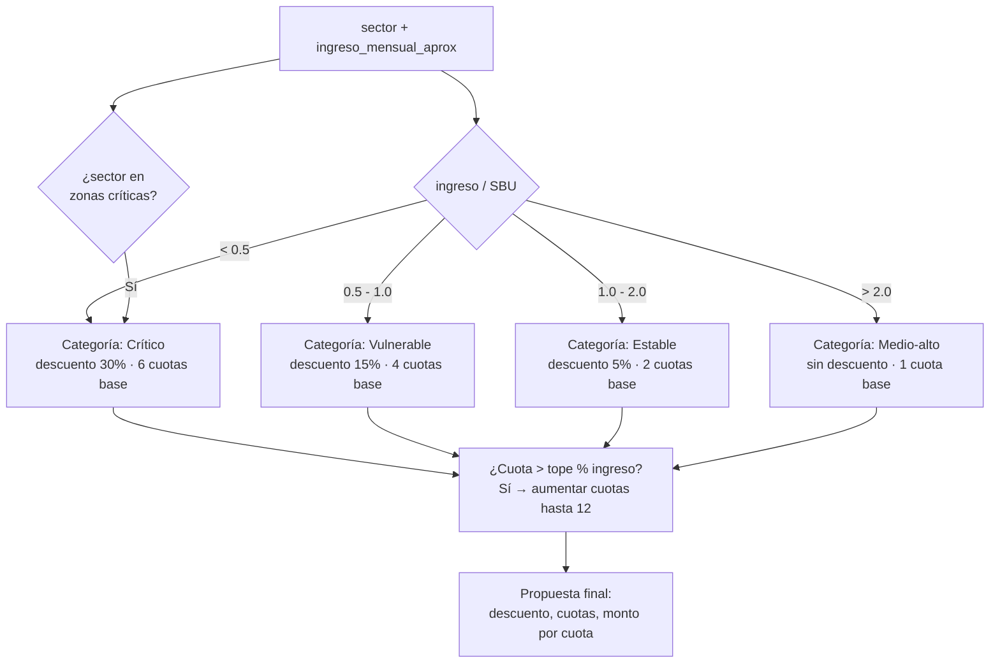

# Diagrama de diseño del agente

## 1. Vista general del flujo de negociación

```mermaid
flowchart TD
    A[Cliente escribe mensaje\nen la interfaz Gradio] --> B[Agente LLM\ngemma4:31b-cloud vía Ollama]

    B -->|"1. ¿Quién es el cliente?"| T1[Tool: consultar_perfil_cliente]
    T1 --> B

    B -->|"2. ¿Qué tan crítico es su contexto?"| T2[Tool: clasificar_contexto_socioeconomico]
    T2 --> B

    B -->|"3. ¿Qué propuesta ofrecer?"| T3[Tool: generar_propuesta_pago]
    T3 --> B

    B -->|Respuesta empática +\npropuesta concreta| C[Cliente]
    C -->|Acepta / pide ajuste /\nrechaza| B

    B -->|"4. Cliente aceptó"| T4[Tool: registrar_acuerdo]
    T4 --> B

    B --> D[Respuesta final al cliente]

    D -.->|Botón: Finalizar negociación| E[Analista LLM\nsalida estructurada Pydantic]
    E --> F[Reporte final:\nsentimiento, resumen,\nresumen y motivo del acuerdo]
```

## 2. Arquitectura de componentes

```mermaid
flowchart LR
    subgraph GUI["Interfaz gráfica (Gradio)"]
        UI1[Panel: perfil del cliente]
        UI2[Chat de negociación]
        UI3[Botón: Finalizar negociación]
    end

    subgraph CORE["Notebook: agente_negociacion_empatica.ipynb"]
        P[PerfilCliente\nestado por sesión]
        CLS[clasificar_contexto_socioeconomico\nlógica pura]
        PROP[generar_propuesta_pago\nlógica pura]
        TOOLS[Tools LangChain\nligadas al perfil]
        AGENTE[create_agent\nLLM + tools + memoria]
        REPORTE[generar_reporte_final\nLLM con salida Pydantic]
    end

    subgraph OLLAMA["Ollama"]
        LLM[(gemma4:31b-cloud)]
    end

    UI1 --> P
    UI2 --> AGENTE
    UI3 --> REPORTE

    AGENTE --> TOOLS
    TOOLS --> CLS
    TOOLS --> PROP
    TOOLS --> P

    AGENTE --> LLM
    REPORTE --> LLM
```

## 3. Clasificación socioeconómica → propuesta de pago

```mermaid
flowchart TD
    Inicio[sector + ingreso_mensual_aprox] --> Ratio{ingreso / SBU}
    Inicio --> Zona{¿sector en\nzonas críticas?}

    Ratio -->|"< 0.5"| Critico
    Zona -->|Sí| Critico[Categoría: Crítico\ndescuento 30% · 6 cuotas base]

    Ratio -->|"0.5 - 1.0"| Vulnerable[Categoría: Vulnerable\ndescuento 15% · 4 cuotas base]
    Ratio -->|"1.0 - 2.0"| Estable[Categoría: Estable\ndescuento 5% · 2 cuotas base]
    Ratio -->|"> 2.0"| MedioAlto[Categoría: Medio-alto\nsin descuento · 1 cuota base]

    Critico --> Ajuste[¿Cuota > tope % ingreso?\nSí → aumentar cuotas hasta 12]
    Vulnerable --> Ajuste
    Estable --> Ajuste
    MedioAlto --> Ajuste

    Ajuste --> Final[Propuesta final:\ndescuento, cuotas, monto por cuota]
```
